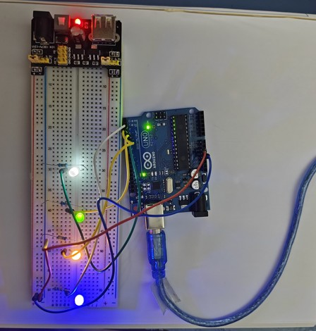
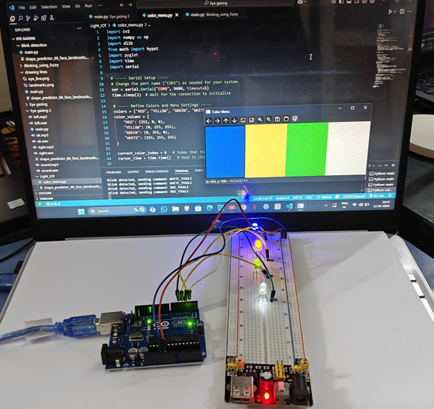

# 🧠 NeuroVision — Eye-Blink Home Appliance Controller

> Control home appliances using only your **eye blinks** — no hands, no voice, no touch.  
> Built with MediaPipe FaceMesh, Python, and Arduino UNO.

---

## 📸 Demo

| Hardware Setup | Color Menu UI |
|---|---|
|  |  |


---

## 🧩 System Architecture

### Software Stack


### IoT Hardware Architecture


---

## ⚙️ How It Works

1. A **webcam** captures your face in real-time.
2. **MediaPipe FaceMesh** detects 468 facial landmarks and computes the **Eye Aspect Ratio (EAR)**.
3. When a **blink is detected** (EAR < 0.2), the system registers it as an intentional command.
4. A scrolling **color menu** (Red / Yellow / Blue / White) cycles on screen every 0.8 seconds.
5. Blinking selects the currently highlighted appliance and toggles it **ON/OFF**.
6. The Python script sends a serial command (e.g., `RED_TOGGLE`) over **USB to the Arduino UNO**.
7. The Arduino toggles the corresponding **LED output** on its digital pins.

---

## 🔧 Hardware Required

| Component | Details |
|---|---|
| Arduino UNO | Microcontroller |
| Breadboard | Full-size |
| LEDs | Red, Yellow, Blue, White |
| Resistors | 4× 220Ω (for LEDs) |
| USB Cable | Arduino ↔ Laptop |
| Webcam | Built-in or external |

### Pin Connections

| Arduino Pin | Connected To |
|---|---|
| D2 | Red LED (via 220Ω) |
| D3 | Yellow LED (via 220Ω) |
| D4 | Blue LED (via 220Ω) |
| D5 | White LED (via 220Ω) |
| 5V | Breadboard power rail |
| GND | Common ground |

---

## 🖥️ Software Setup

### 1. Clone the Repository

```bash
git clone https://github.com/LIKTHANSH/NeuroVision.git
cd NeuroVision
```

> ⚠️ **Note:** The `demo/` folder is excluded from this repo (personal files). All source code and documentation is included.

### 2. Install Python Dependencies

Make sure you have **Python 3.8+** installed.

```bash
pip install -r requirements.txt
```

### 3. Upload Arduino Firmware

- Open `firmware/neurovision_home.ino` in the **Arduino IDE**
- Select your board: **Arduino UNO**
- Select the correct **COM port**
- Click **Upload**

### 4. Run the Python Script

Connect your Arduino via USB, then:

```bash
python software/main.py
```

- The script will list available serial ports — select the one your Arduino is on.
- A **Color Menu** window and **webcam feed** will open.
- Blink intentionally to toggle the highlighted appliance.
- Press `ESC` to quit.

---

## 📁 Project Structure

```
NeuroVision/
├── firmware/
│   └── neurovision_home.ino   # Arduino sketch
├── software/
│   └── main.py                # Python + MediaPipe controller
├── docs/
│   ├── system_arch.png        # Software block diagram
│   └── hardware_arch.png      # IoT hardware diagram
├── demo/                      # ⚠️ Not included (personal)
├── requirements.txt           # Python dependencies
├── .gitignore
└── README.md
```

---

## 📦 Requirements

See [`requirements.txt`](requirements.txt) for full list.

Core dependencies:
- `opencv-python` — Webcam capture and display
- `mediapipe` — FaceMesh landmark detection
- `numpy` — EAR computation
- `pyserial` — Serial communication with Arduino

---

## 🧠 About NeuroVision

NeuroVision is an assistive technology project designed to help people with motor impairments control their environment using **only eye movement and blinks**.

This repository covers the **Home Appliance Control** module.  
The **Virtual Keyboard** module lives in a separate repository.

---

## 📄 License

This project is for educational and research purposes.  
© 2025 LIKTHANSH — All rights reserved.
